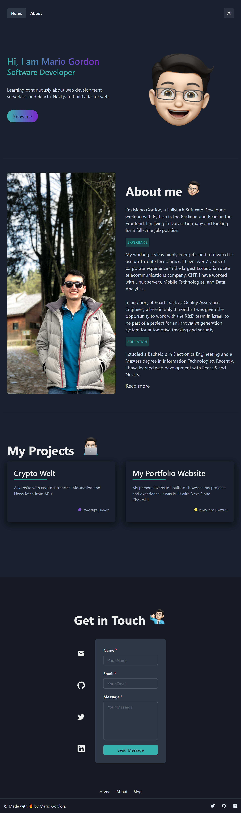

# Portfolio Website built in Next JS

## What do you get in return:

#### Full screenshot



---

## Tech stack:

### Frontend:

- HTML
- Chakra UI
- Javascript ES6+
- Next.js

## Hosting:

- Netlify

## Project management:

- Git and Github for version control

---

## Contributors:

Team who participated in this project:

- [Mario Gordon](https://github.com/maegop)

---

## Where can you find the project?

### [Working website](https://mariogordon.netlify.app//)

---

## Getting started with the project 🚀

The following instructions will get you a copy of the project up and running on your local machine for development purposes.
You'll need to do a couple of things in order to run this project on your local machine:

1. Clone the repository:

```sh
git clone https://github.com/maegop/portfolio-MarioGordon.git
```

2. Install dependencies:

```sh
npm install # or yarn install
```

3. Run the frontend server:

```sh
npm run dev # or yarn dev
```

4. Open the frontend in your browser:

```sh
http://localhost:3000
```

---
